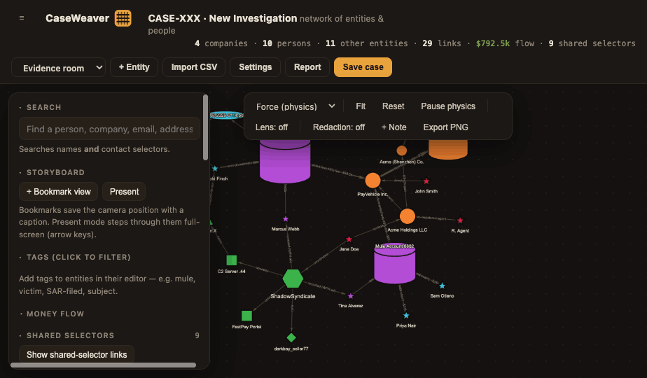
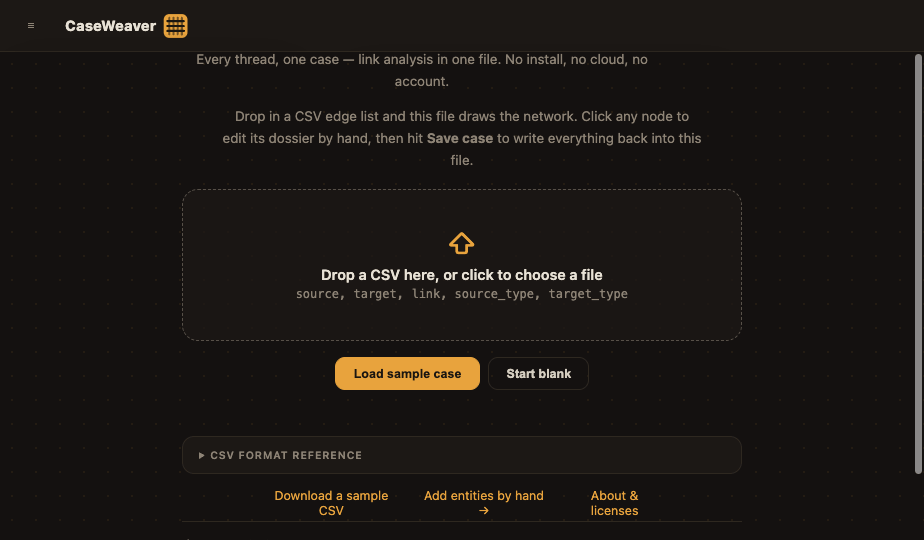
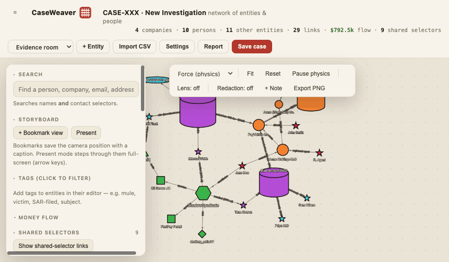
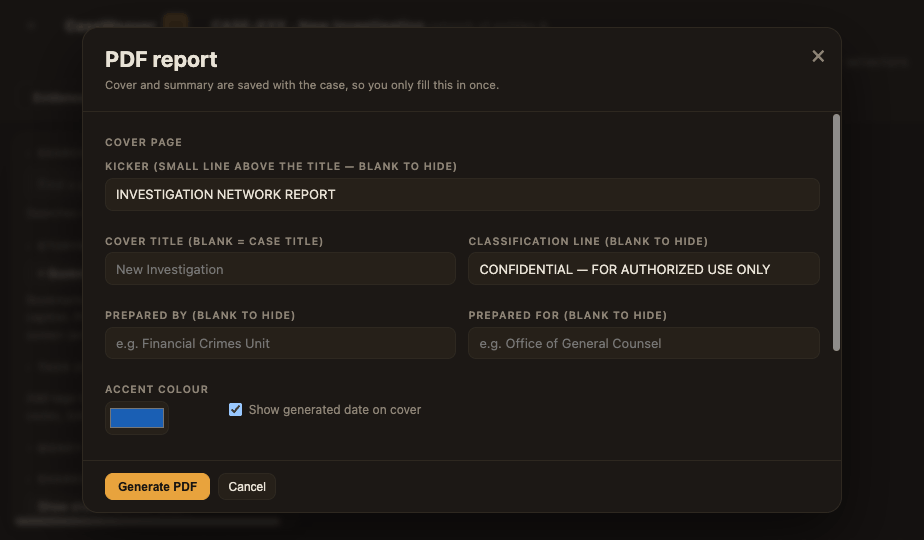

<p align="center">
  
</p>

<h1 align="center">CaseWeaver</h1>
<p align="center"><b>The case file that draws itself.</b><br/>
Self-contained link-analysis dashboard in a single HTML file. No install, no server, no account, no network calls.</p>

---

## What it is

Drop a CSV edge list onto `CaseWeaver.html` and it renders an interactive network of your case — people, companies, infrastructure, malware, accounts, groups, locations, financial vehicles, events, and evidence. Work every entity by hand (dossiers, contact selectors, relationships, photos, tags, money flows), then hit **Save** and everything writes back into the file itself.

The graph engine (vis-network) and PDF library (jsPDF) are bundled inside, so it runs identically on a locked-down corporate laptop, an air-gapped forensics box, or a field machine with no internet.

**Who it's for:** fraud and AML investigators, OSINT researchers, corporate security and due-diligence teams, journalists, and cyber threat analysts — anyone who needs to see who connects to whom and hand the answer to someone else without standing up i2, Maltego, or a graph database.

## Quick start

1. Download [`CaseWeaver.html`](CaseWeaver.html) and open it in any modern browser.
2. Click **Load sample case** to explore a worked fraud → mule → laundering operation, or drop in your own CSV.
3. Click any node to open its dossier; **Shift+drag** from a node to draw a new link.
4. Hit **Save case** — on Chrome/Edge the first save asks where once, then every save silently rewrites that same file; on Safari/Firefox your edits are kept in the browser for that file (Shift+Save downloads a portable copy). That file *is* the case: copy it for snapshots, drop it on a shared drive, or hand it to counsel. An optional **Auto-save** toggle (off by default) sits next to it.

> 🔐 **Store the file encrypted at rest.** Everything you enter is saved inside the HTML in plain text — keep it on full-disk-encrypted storage (BitLocker, FileVault, LUKS) and share it only over encrypted channels.

## CSV format

One flat file, two kinds of rows:

```csv
source,target,link,source_type,target_type,source_cluster,target_cluster,amount,date
Jane Doe,Acme Holdings LLC,controls,person,company,Operators,Shells,,
PayVehicle Inc.,Offshore Fund Ltd,layering transfer,company,financial,Shells,Shells,262000,2026-05-02
Jane Doe,"1 Main St, Anytown",,person,address,,,,
```

- **Relationship rows** — `source` and `target` are two entities; `link` becomes the edge label. Types: `person`, `company`, `infrastructure`, `account`, `malware`, `group`, `location`, `financial`, `event`, `document` (blank = company). Optional `amount`/`date` enable money-flow analysis.
- **Selector rows** — set `target_type` to a contact field (`address`, `email`, `phone`, `domain`, `id`, `ip`, `device`, `wallet`, `hash`, `url`, `user`, `mac`) and the value attaches to the source entity instead of becoming a node.
- Natural column aliases are accepted (`from`/`to`, `src`/`dst`, `md5`, `handle`, …); repeated names merge into one node; values containing commas go in quotes.

See [`samples/sample-case.csv`](samples/sample-case.csv) for a complete example exercising every field.

## Features

- **Shared-selector engine** — identical values on two-plus entities auto-flag as hidden connections: two shells registered at the same address, two personas reusing a handle, two campaigns beaconing to the same C2 IP. Smart matching (last-10-digit phones, separator-blind MACs).
- **Hand-built dossiers** — role, significance, notes, tags, relationships with amounts and dates.
- **Stable arrangement + undo** — edits never reset your layout, camera, or filters; every change is undoable (`Ctrl/Cmd-Z`, up to 50 steps).
- **Buckets** — collapse a selection of nodes into one expandable container; explore inside, remove members, copy every label as a pasteable list.
- **Pin & annotate** — anchor key nodes in place while physics arranges the rest; pin text notes to the canvas or tie them to a node so they follow it.
- **Multi-cluster membership** — a node can belong to several clusters; adding it to another never removes it from the ones it's already in.
- **Bulk actions** — box-select then move/add clusters, tag, re-shape, bucket, pin, or copy labels for the whole selection at once.
- **Money flow analysis** — edge thickness by amount, in/out totals per entity, min-amount and date filters, upstream/downstream fund tracing.
- **Six layouts + lens** — force, spaced clusters, grid, radial, org chart, timeline; lens mode spotlights any node's neighborhood; tunable node spacing.
- **Storyboard & Present mode** — bookmark whole scenes (camera, filters, highlights) and step through them full-screen for briefings.
- **Redaction toggle** — one click masks names and selectors everywhere, including exports (icons, photos, and shapes stay visible).
- **Auto-save** — off by default; timer-based (1–5 min, hourly, or daily) so it never bogs the graph down.
- **CSV view & round-trip** — filterable table of the whole case; copy or download as a CSV that re-imports cleanly.
- **Imports from any older CaseWeaver file** — drop a saved dashboard `.html` from any version to load or merge it.
- **PDF report** — multi-page report (customizable cover, executive summary, key figures, graph, per-entity dossiers) plus PNG graph captures.
- **8 themes** — Evidence room, Counsel copy (print-friendly light), Neon Grid, Ghost Shell, Night Ops, Radar Room, Microfiche, Thermal.
- **28 cyber icons** — servers, C2, malware, and a full telephony set (VOIP infrastructure, soft phone, cell phone, landline, SIP gateway, ISP).
- **Scales past a thousand entities.**

## Documentation

- **[USER_GUIDE.md](USER_GUIDE.md)** — full walkthrough of every feature, with screenshots.
- **[CODE_DOCUMENTATION.md](CODE_DOCUMENTATION.md)** — architecture, data model, and embedded logic for code review and developer hand-off.
- **[CHANGELOG.md](CHANGELOG.md)** — what changed in each release.

## Screenshots

| | |
|---|---|
|  |  |
|  |  |

## Privacy by design

No telemetry, no cloud, no CDN, no fonts fetched — the file never phones home. Open the network tab and watch nothing happen.

## License

MIT — see [LICENSE](LICENSE). Bundled third-party libraries are listed in [THIRD_PARTY_NOTICES.md](THIRD_PARTY_NOTICES.md).

## Contributing

Bug reports and PRs welcome — see [CONTRIBUTING.md](CONTRIBUTING.md). Security issues: see [SECURITY.md](SECURITY.md).
