# CaseWeaver User Guide (v1.001)

A complete walkthrough of every feature. CaseWeaver is one self-contained HTML file — no
install, no server, no account. Open `CaseWeaver.html` in any modern browser and everything
below is available offline.

> **Store the file encrypted at rest.** Everything you enter is saved inside the HTML in
> plain text. Keep it on full-disk-encrypted storage and share it only over encrypted
> channels.

---

## Table of contents

1. [Getting data in](#1-getting-data-in)
2. [The workspace](#2-the-workspace)
3. [Working the graph](#3-working-the-graph)
4. [Entities & dossiers](#4-entities--dossiers)
5. [Clusters — including multi-cluster membership](#5-clusters)
6. [Selections & bulk actions](#6-selections--bulk-actions)
7. [Buckets](#7-buckets)
8. [Pinning nodes](#8-pinning-nodes)
9. [Notes — free and anchored](#9-notes)
10. [Undo](#10-undo)
11. [Saving & auto-save](#11-saving--auto-save)
12. [Shared selectors](#12-shared-selectors)
13. [Filters: tags, money flow, connections](#13-filters)
14. [Tracing funds](#14-tracing-funds)
15. [Layouts, physics & spacing](#15-layouts-physics--spacing)
16. [Lens mode](#16-lens-mode)
17. [Redaction](#17-redaction)
18. [Storyboard & Present mode](#18-storyboard--present-mode)
19. [CSV view & exports](#19-csv-view--exports)
20. [PDF report & PNG export](#20-pdf-report--png-export)
21. [Themes & settings](#21-themes--settings)
22. [Keyboard & mouse reference](#22-keyboard--mouse-reference)

---

## 1. Getting data in

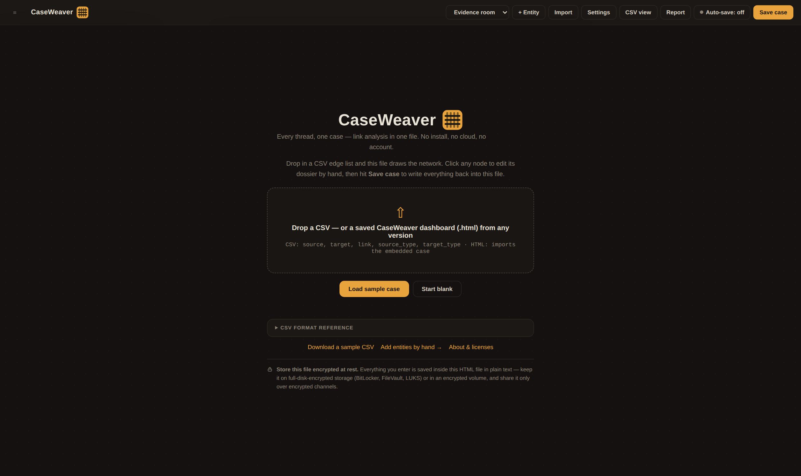

When the file has no case data yet you land on the import screen. Three ways to start:

**Drop a CSV edge list.** One flat file, two kinds of rows:

```csv
source,target,link,source_type,target_type,source_cluster,target_cluster,amount,date
Jane Doe,Acme Holdings LLC,controls,person,company,Operators,Shells,,
PayVehicle Inc.,Offshore Fund Ltd,layering transfer,company,financial,Shells,Shells,262000,2026-05-02
Jane Doe,"1 Main St, Anytown",,person,address,,,,
```

- *Relationship rows* connect two entities; `link` becomes the edge label. Entity types:
  `person`, `company`, `infrastructure`, `account`, `malware`, `group`, `location`,
  `financial`, `event`, `document` (blank = company). Infrastructure also accepts telecom
  aliases: `voip`, `sip_gateway`, `isp`, `softphone`, `cellphone`, `landline`.
  Optional `amount` and `date` light up money-flow analysis.
- *Selector rows* set `target_type` to a contact field (`address`, `email`, `phone`,
  `domain`, `id`, `ip`, `device`, `wallet`, `hash`, `url`, `user`, `mac`) — the value
  attaches to the source entity instead of becoming a node.
- Natural column aliases are accepted (`from`/`to`, `src`/`dst`, `md5`, `handle`, …).
  Repeated names merge into one node. Values containing commas go in quotes.

Each import run is tagged (`import1`, `import2`, …) so you can filter to exactly what a
given file contributed. Importing into an existing case **merges**; importing into an empty
case **replaces**.

**Drop a saved CaseWeaver dashboard (.html).** Any dashboard saved with **any older
CaseWeaver version** — back to the first release — can be dropped straight onto the import
screen (or opened via the top-bar **Import** button). CaseWeaver extracts the embedded case
data. If your current case is empty the imported case loads as-is; otherwise you choose:

- **OK — merge**: adds its entities, links, clusters, and notes to the current case
  (existing entities with the same id are kept, duplicate links are skipped, colliding
  cluster names are imported side-by-side).
- **Cancel — replace**: the imported case replaces everything.

**Start by hand.** *Load sample case* opens a worked fraud → mule → laundering operation to
explore. *Start blank* opens the entity editor so you can build the case node by node.

To bring more data in later, use **Import** in the top bar — it returns to this screen.

## 2. The workspace

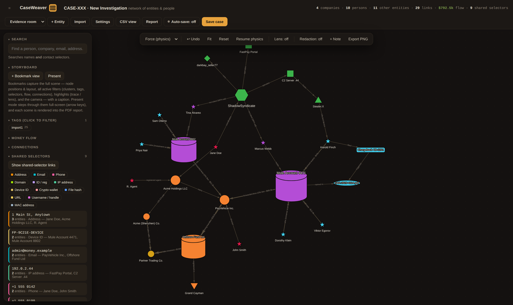

- **Top bar** — case title and live stats, plus: theme picker, **+ Entity**, **Import**,
  **Settings**, **CSV view**, **Report**, **Auto-save toggle**, **Save case**.
- **Left sidebar** — Search, Storyboard, Tags, **Buckets**, Money flow, Connections,
  Shared selectors, Clusters, and the type legend. Every section folds on heading click;
  the ☰ button collapses the whole sidebar.
- **Graph toolbar** (top of canvas) — layout picker, **↩ Undo**, Fit, Reset, physics
  pause/resume, Lens, Redaction, **+ Note**, Export PNG. On narrow windows it collapses to
  a slim ⚙ handle that expands on hover so it never covers the detail pane.
- **Detail pane** (right) — opens when you click a node; shows the dossier summary,
  selectors, and grouped relationships.
- **Selection bar** (bottom) — appears whenever 2+ nodes are selected; hosts all bulk
  actions.

## 3. Working the graph

- **Click** a node → detail pane. **Double-click** → full editor.
- **Drag** nodes to arrange them; **scroll** to zoom; **drag empty space** to pan.
- **Shift+drag from a node** draws a new relationship to another node.
- **Shift+drag empty space** box-selects. **Ctrl/Cmd-click** adds to the selection.
- **Fit** frames the whole graph; **Reset** clears filters and refits.
- Since v1.001 the arrangement is **stable**: edits, imports, and setting changes keep
  every node where you put it, along with your camera position, physics pause state, and
  active filters.

## 4. Entities & dossiers

Click a node, then **Open full dossier** (readable summary) or **Edit dossier**:

- Name, type (drives the default shape and redaction tag), role/title, significance,
  notes, and comma-separated tags.
- **Photo** (stored inside the file, auto-shrunk), **cyber icon** (network/systems glyphs
  drawn in the cluster colour — including VOIP infrastructure, soft phone, cell phone,
  landline phone, SIP gateway, and ISP), **emoji icon**, or a geometric **shape**.

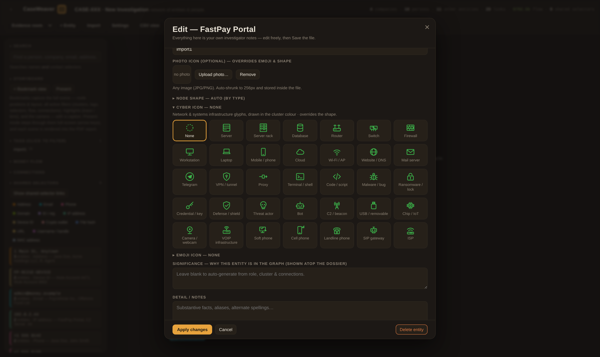

- **Contact selectors** — one value per line per type. Matching is smart: phones compare by
  their last 10 digits, MACs ignore separators.
- **Relationships** — add/edit/remove links to other entities with direction, label, weak
  flag (dashed), amount, and date.

The detail pane groups an entity's connections into **Outgoing** and **Incoming** with
counts, merges duplicate links to the same counterpart, and collapses long lists behind
*show more*:

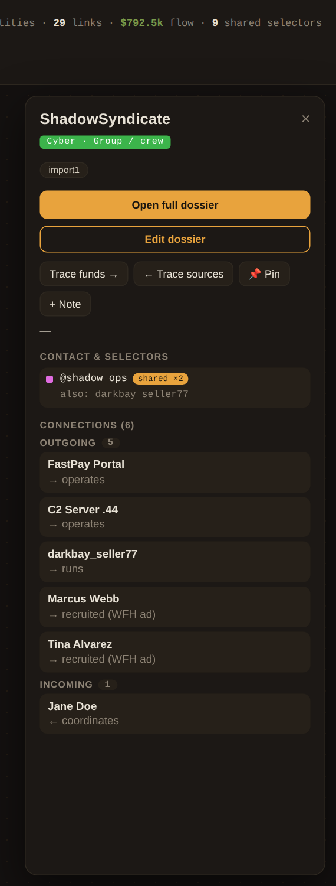

## 5. Clusters

Clusters are your case's organising colour groups (crews, phases, jurisdictions…). Manage
them in **Settings** (rename, recolour, add, delete). Click a cluster in the sidebar legend
to show/hide it.

**Multi-cluster membership (new).** A node can belong to several clusters at once:

- Every node has a **primary cluster** — it sets the node's colour.
- In the editor, tick **Also in clusters** checkboxes to add further memberships. Adding a
  node to another cluster **never removes it from its existing ones**.
- In bulk: select nodes and use **Also add to cluster…** in the selection bar (keeps all
  existing memberships) or **Move to cluster…** (changes the primary).
- Filtering: a node stays visible if *any* of its clusters is active. Extra memberships
  show as additional badges in the detail pane.

## 6. Selections & bulk actions

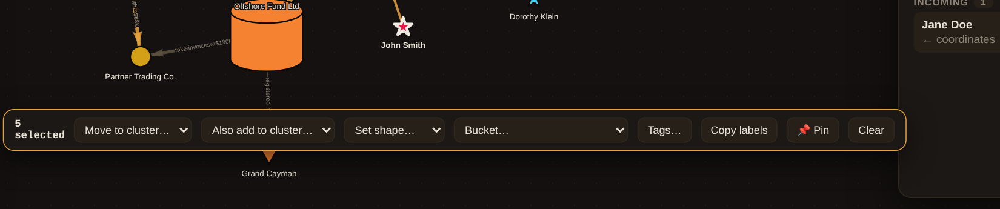

Box-select (Shift+drag empty space) or Ctrl/Cmd-click nodes. With 2+ selected, the
selection bar offers:

- **Move to cluster…** — change the primary cluster of every selected node.
- **Also add to cluster…** — add a membership without removing any existing cluster.
- **Set shape…** — bulk-change the node shape for the whole selection (or back to *Auto*).
- **Bucket…** — collapse the selection into a new bucket, or add it to an existing one.
- **Tags…** — add/remove tags in bulk (`mule, -victim` adds one, removes the other).
- **Copy labels** — copies every selected label to the clipboard as a plain list, one per
  line, ready to paste anywhere.
- **📌 Pin / Unpin** — anchor the selection in place (see below).

## 7. Buckets

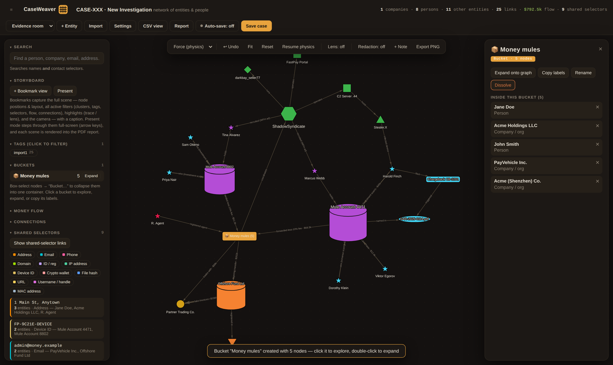

Buckets collapse many nodes into a single container node — perfect for tidying a swarm of
mule accounts or low-value leads while you work the core of the case.

- **Create:** select nodes → selection bar → **Bucket… → + Collapse into new bucket**, name
  it. The members disappear into one 📦 node; their edges re-route to the bucket
  (aggregated — multiple links show a count and summed amounts).
- **Explore:** click the bucket node (or its row in the sidebar **Buckets** panel) to list
  everything inside. Click a member to see its mini-dossier.
- **Remove members:** ✕ next to any member returns just that node to the graph; removing
  the last member deletes the bucket.
- **Expand / re-collapse:** double-click the bucket node (or use the buttons in the pane /
  sidebar) to pour the members back onto the graph and pack them up again later.
- **Copy labels** copies every member's label as a pasteable list — the same list feature
  as the selection bar, but for the whole bucket.
- **Dissolve** deletes the bucket and restores all members.
- A node lives in at most one bucket; adding it to another moves it. Buckets, their
  members, and their collapsed/expanded state save with the file.

## 8. Pinning nodes

Pin nodes to anchor them in place **while physics keeps arranging everything else** — lay
out your key subjects by hand, pin them, and let the rest of the graph settle around them.

- **Single node:** detail pane → **📌 Pin** (click again to unpin). Pinned nodes get a
  highlighted border.
- **Many nodes:** select them → **📌 Pin** in the selection bar.
- Pinned nodes ignore physics and layout runs but can still be dragged by hand (their new
  spot sticks). Pinned positions are saved into the file.

## 9. Notes

**+ Note** (graph toolbar) pins text onto the canvas.

- **Free note:** click **+ Note** with nothing selected — the note lands at the view centre;
  drag it anywhere.
- **Anchored note (new):** select exactly one node first (or use **+ Note** in the node's
  detail pane). The note is tied to that node with a short dashed leash and **follows the
  node** as physics or dragging moves it.

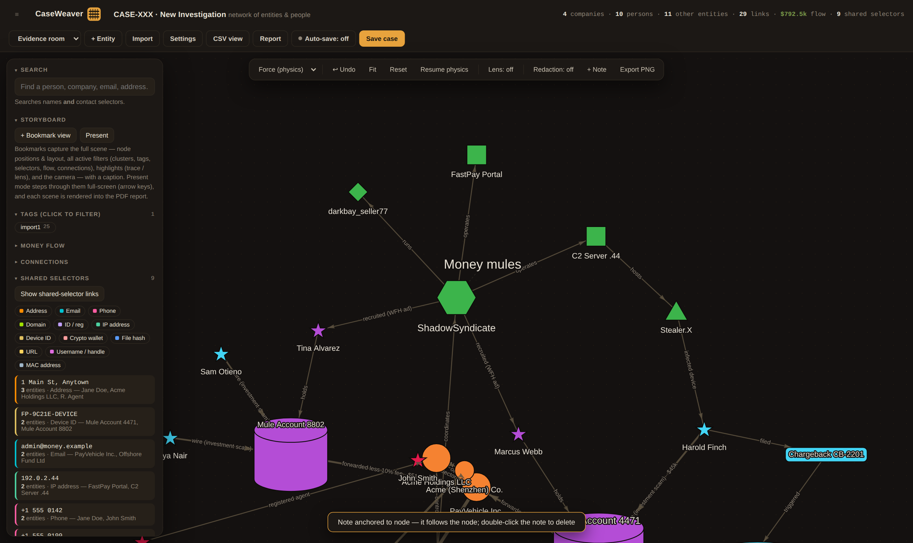

- Double-click a note to delete it. Deleting a node unanchors (but keeps) its notes.
- Notes save with the file and appear in exports.

## 10. Undo

Every change to case data can be undone — entity edits and deletions, imports, cluster
moves, bulk tags, shapes, buckets, notes, pins, and settings changes. Up to 50 steps.

- Press **Ctrl/Cmd-Z**, or click **↩ Undo** in the graph toolbar (its tooltip names the
  next change to be undone).
- Undo restores the data *and* the node positions from before the change.
- Text fields keep the browser's own text undo while you're typing in them.

## 11. Saving & auto-save

**Save case** writes the entire case back into the HTML file itself:

- **Chrome / Edge:** the first save shows a file picker; every later save silently rewrites
  the same file (the choice is remembered across sessions).
- **Safari / Firefox:** the case is stored in the browser for that file — reopening the
  same file restores your edits. **Shift+Save** downloads a portable updated copy instead
  (use that to move or share the file).

**Auto-save** — the toggle sits in the top bar next to Save case:

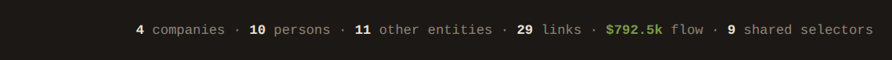

- **Off by default.** Click to arm it (the dot turns green and the button shows the
  interval).
- It saves **on a timer only** — never after every interaction, so it can't bog down the
  graph. If nothing changed since the last save, the tick does nothing.
- Set the interval in **Settings → Auto-save**: a **1–5 minute slider**, **1 hour**, or
  **1 day**.
- Auto-save is completely silent: it reuses the remembered file handle when it already has
  permission, otherwise it saves the browser snapshot. It never pops a picker. The
  setting itself saves with the case.

## 12. Shared selectors

The quiet star of the tool. Identical selector values on two or more entities — the same
address, email, phone, device fingerprint, wallet, C2 IP — are flagged automatically as
hidden connections.

- The sidebar **Shared selectors** panel lists every overlap, most-shared first, with the
  entity names capped at three and a **+N more** expander (new) so big overlaps stay
  compact. The same treatment applies to the "also:" lists in the detail pane.
- Click an item to highlight and zoom the entities that share it.
- **Show shared-selector links** overlays dashed, colour-coded selector edges on the graph;
  the chips filter by selector type.
- In a node's detail pane, shared selectors carry a `shared ×N` badge — click to focus.

## 13. Filters

- **Clusters** — click legend entries to show/hide. Works with multi-membership (a node
  hides only when *all* of its clusters are off).
- **Tags** — click tag chips to show only matching entities. Tag in bulk from the selection
  bar.
- **Money flow** — hide relationship edges below a minimum amount and/or outside a date
  window.
- **Connections** — show only entities with at least N relationships (2 hides everything
  with a single link; Clear resets).
- **Reset** (toolbar) clears the lot. Filters now survive edits and rebuilds.

## 14. Tracing funds

Open an entity's detail pane:

- **Trace funds →** follows outgoing relationship edges downstream, highlighting the chain.
- **← Trace sources** walks incoming edges upstream.
- Click empty canvas to clear. Combine with money-flow filters to trace only
  above-threshold transfers. Flow in/out totals appear in the pane for entities with
  amounts.

## 15. Layouts, physics & spacing

The toolbar's layout picker offers: **Force (physics)** — the living, spring-embedded
default; **Spaced clusters** — each cluster in its own tidy block; **Grid by cluster**;
**Radial** — rings around a chosen root (pick it in the root dropdown); **Org chart** —
top-down hierarchy from the root; **Timeline** — entities ordered by their dated
relationships.

- **Pause physics** freezes the simulation for hand-arranging; Resume lets it settle again.
  Big graphs (250+ nodes) pause automatically after stabilising.
- **Pinned nodes hold their spot through every layout and physics run.**
- **Spacing (new):** the default resting edge length is 1.5× the old build — nodes overlap
  far less out of the box. Tune it in **Settings → Graph spacing** (0.5×–3×): raise it for
  hairballs you'd previously untangle by hand, lower it for tight clusters.

## 16. Lens mode

**Lens: off → on**, then click any node to spotlight its neighborhood (1 or 2 hops — the
depth dropdown) and dim everything else. Click empty canvas to clear, or switch the lens
off. Great for briefings: combine with Storyboard bookmarks.

## 17. Redaction

**Redaction: off → on** masks identity everywhere — graph labels, sidebar, detail panes,
dossiers, CSV view, and PDF/PNG exports:

- Names collapse to initials with a type tag (`Jane Doe` → `J.D.`, companies get `[Co]`…).
- Phones show only the last 4 digits; emails keep first letters; other selectors truncate.
- **The node's photo, icon, and shape stay visible** (new) — only the visible label text is
  masked. Toggle off to restore everything; the underlying data never changes.

## 18. Storyboard & Present mode

- **+ Bookmark view** captures the full scene — node positions, layout, camera, every
  active filter, trace/lens highlights — with a caption.
- Bookmarks are listed in the sidebar; click to jump back. Each bookmark also becomes a
  rendered scene page in the PDF report.
- **Present** steps through your bookmarks full-screen (arrow keys / on-screen controls),
  hiding every panel — an instant briefing deck.

## 19. CSV view & exports

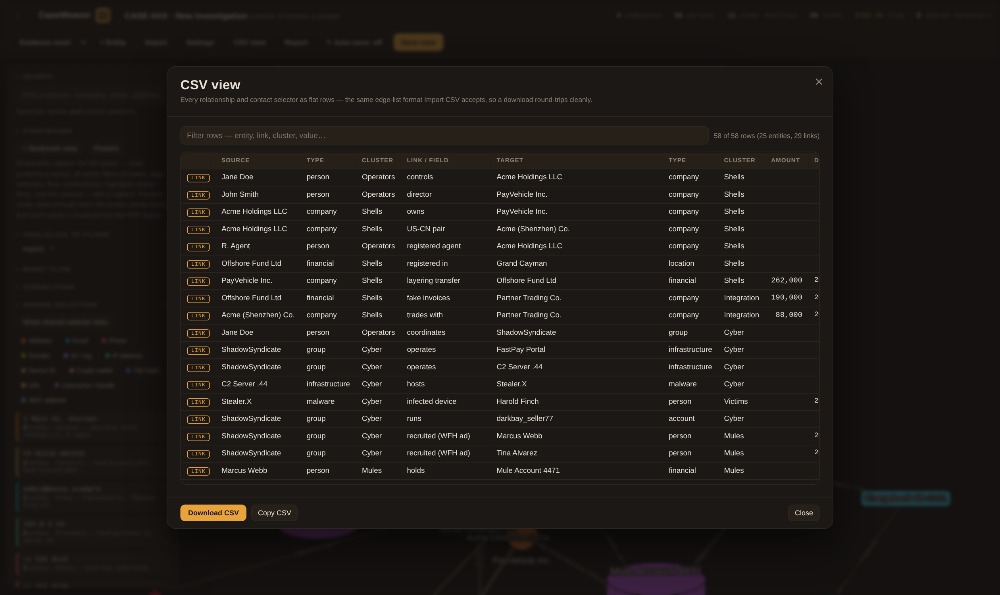

**CSV view** (top bar) shows the whole case as a filterable table — relationship rows and
selector rows exactly as the importer understands them.

- Type in the filter box to narrow rows live.
- **Copy** puts the filtered rows on the clipboard; **Download CSV** saves them.
- Downloads are round-trippable: the exported CSV re-imports into any CaseWeaver file.

Also: **Copy labels** (selection bar or bucket pane) exports plain label lists, and any
saved CaseWeaver HTML is itself an import source on another copy (see
[Getting data in](#1-getting-data-in)).

## 20. PDF report & PNG export

- **Report** (top bar) → set title, subtitle, classification banner, case summary, and
  cover options → **Generate PDF**. The report includes the cover, executive summary, key
  figures, a high-resolution graph capture, each storyboard scene, and per-entity dossiers.
  Redaction, filters, and themes all apply.
- **Export PNG** (toolbar) captures the current graph view — visible nodes, current
  positions — at high resolution on the theme background.

## 21. Themes & settings

- **Theme picker** (top bar): Evidence room (dark default), Counsel copy (print-friendly
  light), Neon Grid, Ghost Shell, Night Ops, Radar Room, Microfiche, Thermal. The theme
  saves with the case and styles exports.
- **Settings** (top bar):

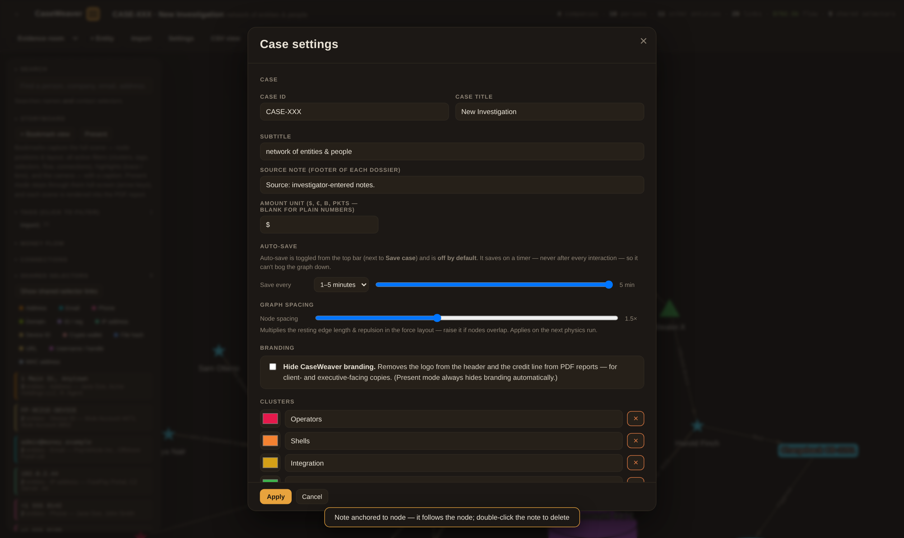

  - Case ID, title, subtitle, source note, amount unit.
  - **Auto-save interval** — 1–5 min slider / 1 hour / 1 day.
  - **Graph spacing** — 0.5×–3× node-spacing multiplier.
  - Branding visibility, cluster manager (add / rename / recolour / delete).

On narrow windows the graph toolbar collapses into a slim ⚙ handle (hover to expand) so it
never covers the detail pane:

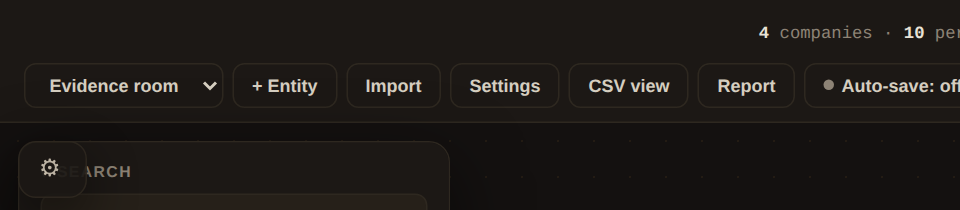

## 22. Keyboard & mouse reference

| Action | Effect |
|---|---|
| Click node | Detail pane |
| Double-click node | Edit dossier |
| Double-click bucket | Expand bucket |
| Double-click note | Delete note |
| Shift+drag from node | Draw a new link |
| Shift+drag empty space | Box-select |
| Ctrl/Cmd-click | Add to selection |
| **Ctrl/Cmd-Z** | Undo last change |
| Scroll / drag canvas | Zoom / pan |
| Shift+click Save case | Download a portable copy |
| Arrow keys (Present mode) | Previous / next scene |
